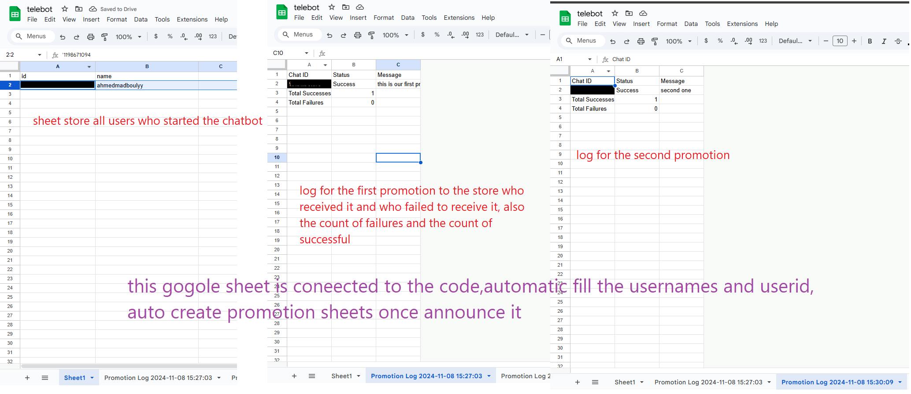
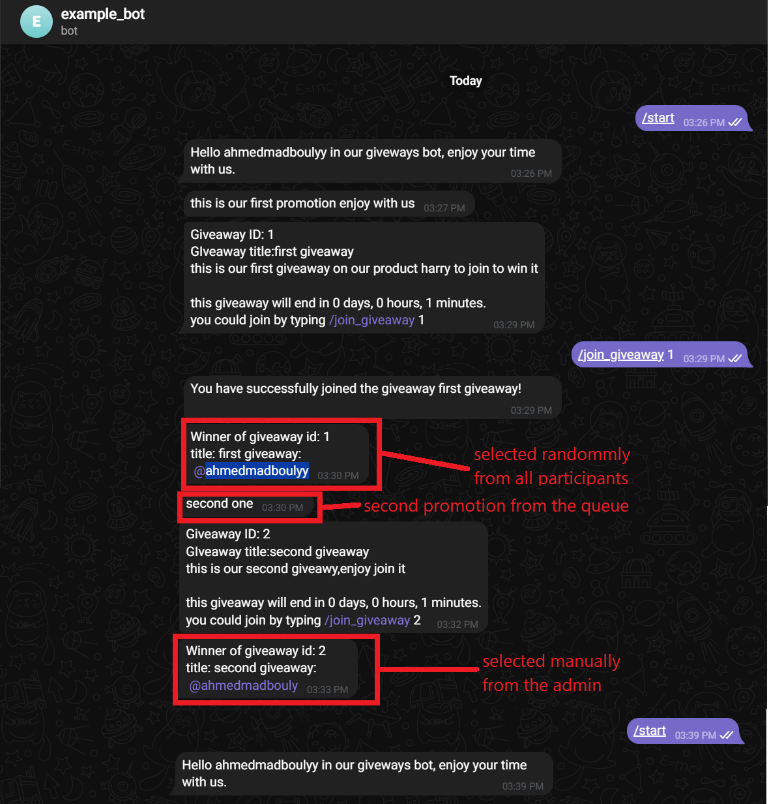

# Telegram Giveaways & Referrals Bot

## 🎯 Executive Summary

A **production-ready Telegram bot** that turns user referrals into a powerful growth engine. Manage giveaways, issue secure reward codes, and broadcast announcements—all from Telegram, with zero database costs.

**Perfect for:** Communities, contests, product launches, or loyalty programs that need transparent, non-technical administration.

---

## 💡 What This Solves

| Challenge                               | Solution                                                                    |
| --------------------------------------- | --------------------------------------------------------------------------- |
| Growing a Telegram audience organically | Automated referral tracking with tier-based rewards                         |
| Rewarding active members securely       | Time-limited, 6-digit reward codes; admin approval workflow                 |
| Broadcasting to all users reliably      | One-command announcements + text, photos, and videos with delivery logs     |
| Keeping costs low                       | Google Sheets replaces expensive databases; editable by non-technical staff |
| Building trust                          | All user data and logs visible in a shared Google Sheet                     |

---

## 🚀 Key Features

- ✅ **Referral Tracking** — Each user gets a unique referral link; invites are counted automatically
- ✅ **Tiered Rewards** — Three reward tiers (Tier 1, 2, 3) based on referral milestones
- ✅ **Secure Reward Codes** — 6-digit codes expire after 14 days; admin confirms redemptions
- ✅ **Admin Broadcasts** — Send text, photos, or videos to all users in one command
- ✅ **Delivery Logs** — Every broadcast creates a timestamped log sheet showing success/failure
- ✅ **Google Sheets Storage** — Transparent, editable datastore; no hidden databases
- ✅ **Production-Ready** — Error handling, threading, and rate-aware design

---

## 📖 User Commands (What Users Type in Telegram)

Once a user starts the bot, they can use these commands:

### `/start`

**What it does:**  
Registers the user in the system. If the user was referred, it records the referral.

**Expected response:**

```
Hello [username] in our giveaways bot, enjoy your time with us.

[Temporary invite link to your community]
use this invitation link for the following [X] minutes. It's allowed to use it only one time:
https://t.me/...
```

**Behind the scenes:**

- User ID, username, and first name are saved to the "users" sheet
- A unique referral code is generated
- A temporary invite link is created (expires after the time set in constants)

---

### `/generate_link`

**What it does:**  
Creates the user's unique referral link so they can share it with friends.

**Expected response:**

```
Here is your referral link:
https://t.me/[your_bot_name]?start=[user_referral_code]
```

**Why it matters:**  
Users can share this link with friends. When a friend uses it and sends `/start`, the referral is logged and the friend's referral count increases.

---

### `/get_referral_count`

**What it does:**  
Shows the user how many people have joined through their referral link and how close they are to earning rewards.

**Expected response:**

```
your referral count is: 5
tire1 limit it : 3
tire2 limit it : 7
tire3 limit it : 12
```

**Interpretation:**

- This user has 5 referrals
- Tier 1 threshold: 3 referrals ✅ _Unlocked_
- Tier 2 threshold: 7 referrals (2 more needed)
- Tier 3 threshold: 12 referrals (7 more needed)

---

### `/generate_reward_code`

**What it does:**  
Once a user reaches a referral threshold (Tier 1, 2, or 3), they can claim a reward code.

**Expected response (for Tier 1):**

```
Congrats you have exceeded tier1 in referrals, here is your reward code:
742891

your code will expire after 14 days
to redeem it write /redeem_reward_code 742891
```

**Expected response (for Tier 2 or 3):**
Same format, but with "tier2" or "tier3" in the message.

**Behind the scenes:**

- The code is a random 6-digit number
- It's logged in the "reward_codes" sheet with owner, tier, and timestamp
- The user's referral count is reduced by that tier's threshold (so they can earn multiple rewards)

---

### `/redeem_reward_code [code]`

**What it does:**  
User submits their reward code to claim the prize.

**Example command:**

```
/redeem_reward_code 742891
```

**Expected response (if valid):**

```
your code is valid, the admin will contact you soon to give you the reward with tier 1
```

**Expected response (if invalid or expired):**

```
your code is invalid or expired
```

**Behind the scenes:**

- The code is checked against the reward_codes sheet
- If valid and less than 14 days old, the code is marked as redeemed
- Admin receives a notification with user ID, username, tier, and code generation time
- The code is removed from the sheet

**Admin receives:**

```
the user with id: 123456789 and username: @john_doe has redeemed the reward code with tier 1 and the code was generated at 2024-01-15 10:30:00
```

---

## 🎛️ Admin Commands (What the Administrator Types)

The admin account (set in Google Sheets) has exclusive access to powerful broadcast features.

### `/broadcast [message]`

**What it does:**  
Sends a text message to all registered users instantly.

**Example command:**

```
/broadcast 🎉 New contest starting today! Join now for exclusive rewards!
```

**Expected response to admin:**

```
Broadcast completed successfully!
```

**Behind the scenes:**

- A new timestamped sheet is created (e.g., "Promotion Log 2024-01-15 14:30:00")
- The message is sent to every user in the users sheet
- Success and failure status is logged for each user
- A summary is appended showing total successes and failures

**What users receive:**

```
🎉 New contest starting today! Join now for exclusive rewards!
```

---

### Send Photo/Video/Document with Broadcast Caption

**What it does:**  
Sends media (photo, video, or document) with a caption to all users.

**How to use:**

1. Upload a photo, video, or file to the chat
2. Add a caption that **contains `/broadcast`** and your message
3. Send it

**Example caption:**

```
/broadcast 🎬 Watch our new product demo!
Click the link below for details.
```

**Expected response to admin:**

```
Broadcast media completed successfully!
```

**Behind the scenes:**

- A new timestamped log sheet is created
- The media is sent to every user with the caption (minus the `/broadcast` command)
- Delivery status (success/failure) is logged for each user
- A summary shows total successes and failures

**What users receive:**

```
[Photo/Video/File]

🎬 Watch our new product demo!
Click the link below for details.
```

---

## 📊 Data Structure (Google Sheets)

The bot stores all data in a Google Sheet with three worksheets:

### **Worksheet: "users"**

| user_id   | username   | first_name | referral_code | referral_count |
| --------- | ---------- | ---------- | ------------- | -------------- |
| 123456789 | john_doe   | John       | 1001          | 5              |
| 987654321 | jane_smith | Jane       | 1002          | 3              |

**Columns:**

- `user_id` — Telegram user ID (unique identifier)
- `username` — Telegram handle
- `first_name` — User's first name
- `referral_code` — Unique numeric code for sharing
- `referral_count` — Number of successful referrals

---

### **Worksheet: "constants"**

| constant_name                    | value          |
| -------------------------------- | -------------- |
| bot_token                        | 123456:ABC...  |
| admin_id                         | 123456789      |
| chat_to_invite_id                | -1001234567890 |
| time_limit_to_acctept_invitation | 10             |
| tire1_limit                      | 3              |
| tire2_limit                      | 7              |
| tire3_limit                      | 12             |

**Key settings:**

- `bot_token` — Your Telegram bot API token (keep private!)
- `admin_id` — Telegram ID of the administrator (only this user can broadcast)
- `chat_to_invite_id` — The Telegram channel/group ID to invite users to
- `time_limit_to_acctept_invitation` — Minutes before invite link expires
- `tire1_limit`, `tire2_limit`, `tire3_limit` — Referral thresholds for each reward tier

---

### **Worksheet: "reward_codes"**

| code   | user_id   | username   | tier | generated_at        |
| ------ | --------- | ---------- | ---- | ------------------- |
| 742891 | 123456789 | john_doe   | 1    | 2024-01-15 10:30:00 |
| 518273 | 987654321 | jane_smith | 2    | 2024-01-15 11:45:00 |

**Columns:**

- `code` — The 6-digit reward code
- `user_id` — Owner's Telegram user ID
- `username` — Owner's username
- `tier` — Reward tier (1, 2, or 3)
- `generated_at` — When the code was issued (auto-expires 14 days later)

---

### **Dynamic Log Sheets**

Each time admin broadcasts, a new sheet is created:

**Example: "Promotion Log 2024-01-15 14:30:00"**
| Chat ID | Status | Message |
|---------|--------|---------|
| 123456789 | Success | New contest starting today! |
| 987654321 | Failed | [Bot was blocked by user] |
| ... | ... | ... |
| **Total Successes** | **15** | |
| **Total Failures** | **2** | |

---

## 🔧 Technical Architecture

**Stack:**

- **Language:** Python 3.9+
- **Bot Library:** pyTelegramBotAPI (telebot)
- **Cloud Storage:** Google Sheets via gspread
- **Authentication:** Google Service Account (credentials.json)
- **Threading:** Python threading for concurrent operations

**Why this design:**

- **Zero database costs** — Google Sheets is free and transparent
- **Non-technical admin** — Staff can edit data directly in the spreadsheet
- **Reliable delivery** — Telegram's API handles messages reliably
- **Audit trail** — All broadcasts and logs are timestamped and saved
- **Scalable** — Works reliably for communities up to ~10,000 users

---

## 📋 Setup Instructions

### For a Developer (or handing off to one):

1. **Create a Telegram Bot**

   - Chat with [@BotFather](https://t.me/botfather) on Telegram
   - Create a new bot and save the API token

2. **Set Up Google Sheets**

   - Create a Google Sheet with three worksheets: `users`, `constants`, `reward_codes`
   - Fill in the `constants` worksheet with your bot token, admin ID, and thresholds
   - Share the sheet with your Google service account email

3. **Get Service Account Credentials**

   - Go to [Google Cloud Console](https://console.cloud.google.com/)
   - Create a service account and download `credentials.json`
   - Keep this file **private** — it's like a password for your bot

4. **Install Dependencies**

   ```bash
   pip install -r requirements.txt
   ```

5. **Set Environment Variables**
   Create a `.env` file in the project folder:

   ```
   API_KEY=your_bot_token_here
   SHEET_URL=https://docs.google.com/spreadsheets/d/your_sheet_id/edit
   ```

6. **Run the Bot**
   ```bash
   python project.py
   ```

---

## 🎬 Demo

To showcase this bot effectively:

1. **Show the Google Sheet**



2. **User signed and join give awya sended by admin then won this giveaway randomly**
   

---

## 💼 Why This Demonstrates Strong Skills

| Skill                           | Evidence                                                                                  |
| ------------------------------- | ----------------------------------------------------------------------------------------- |
| **Business Understanding**      | Solved a real problem (community growth + transparent rewards) without overengineering    |
| **Python Mastery**              | Clean code using telebot, gspread, threading, date handling, error management             |
| **API Integration**             | Integrated Telegram Bot API and Google Sheets API seamlessly                              |
| **Database Design**             | Chose Google Sheets as an unconventional but brilliant data layer for transparency        |
| **Security Awareness**          | Kept secrets in `.env` and credentials; admin-only commands protected; 14-day code expiry |
| **Production Thinking**         | Error handling, logging, delivery confirmations, and delivery logs                        |
| **Non-Technical Communication** | Designed UX so non-technical admins can manage the entire system                          |
| **Scalability**                 | Works for small communities now; can migrate to a real database for 10k+ users            |

---

## 🚨 Security & Best Practices

- ✅ **Keep `credentials.json` private** — Never commit to git
- ✅ **Keep bot token in `.env`** — Don't expose in code
- ✅ **Admin-only commands** — `/broadcast` only works if sender matches admin_id
- ✅ **Code expiry** — Reward codes auto-expire after 14 days
- ✅ **Rate limiting** — Large broadcasts respect Telegram API limits
- ✅ **Error handling** — Bot recovers gracefully if messages fail

---

## 🛣️ Future Enhancements

- 📈 **Scale to 10k+ users** — Migrate from Google Sheets to PostgreSQL or Firebase
- 🤖 **Automated giveaways** — Schedule contests to run at specific times
- 📱 **Light admin dashboard** — Web interface for non-technical admins
- 🎁 **Weighted rewards** — Different prizes based on tier
- 📞 **Support system** — Users can message admin directly via bot
- 🔔 **Notifications** — Alert admins when someone redeems a code

---

## 📞 Contact & Handoff

Ready to deploy? I'll provide:

- ✅ The Google Sheet URL (pre-configured)
- ✅ `credentials.json` (kept secure)
- ✅ A quick video demo (1–2 minutes)
- ✅ Annotated screenshots showing setup
- ✅ Admin quick-start guide (one page)

---

## 📜 Files in This Project

- **[project.py](project.py)** — Main bot logic (500+ lines of production code)
- **[requirements.txt](requirements.txt)** — Python dependencies
- **[credentials.json](credentials.json)** — Google service account (private)
- **.env** — Bot token and sheet URL (private)
- **[README.md](README.md)** — This file

---

## ⚡ Quick Commands Reference

| User Command                 | Purpose                         | Example                      |
| ---------------------------- | ------------------------------- | ---------------------------- |
| `/start`                     | Register + get invite link      | (automatic on first use)     |
| `/generate_link`             | Get referral link               | `/generate_link`             |
| `/get_referral_count`        | Check progress toward rewards   | `/get_referral_count`        |
| `/generate_reward_code`      | Claim reward after hitting tier | `/generate_reward_code`      |
| `/redeem_reward_code 742891` | Redeem a 6-digit code           | `/redeem_reward_code 742891` |

| Admin Command          | Purpose                 | Example                                    |
| ---------------------- | ----------------------- | ------------------------------------------ |
| `/broadcast [message]` | Send text to all users  | `/broadcast 🎉 New contest!`               |
| `/broadcast [caption]` | Send media to all users | (Upload photo + caption with `/broadcast`) |

---

## 📈 Success Metrics

Once live, track:

- **Total users** — Growing community
- **Referral rate** — % of users who refer others
- **Tier conversions** — How many hit each reward threshold
- **Code redemption rate** — Trust and engagement indicator
- **Broadcast reach** — Delivery success rate

---

**Built with ❤️ to grow communities and reward loyalty.**
